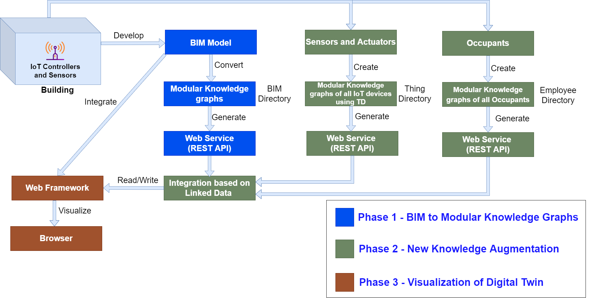
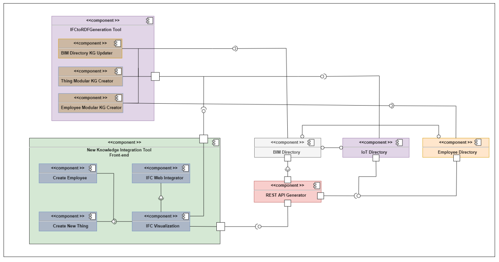
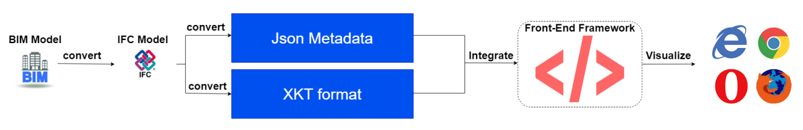
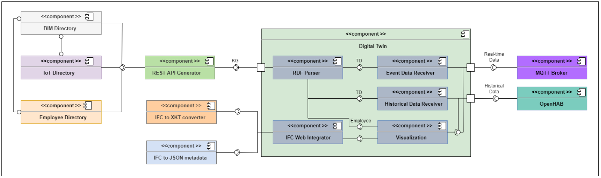
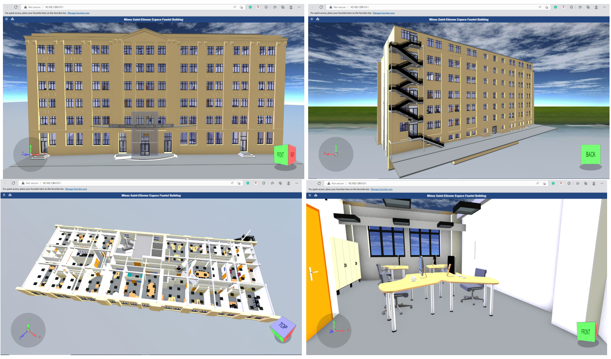
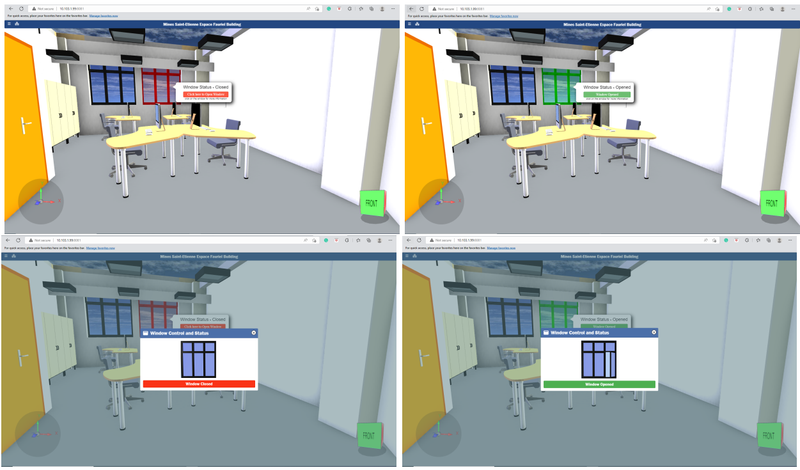
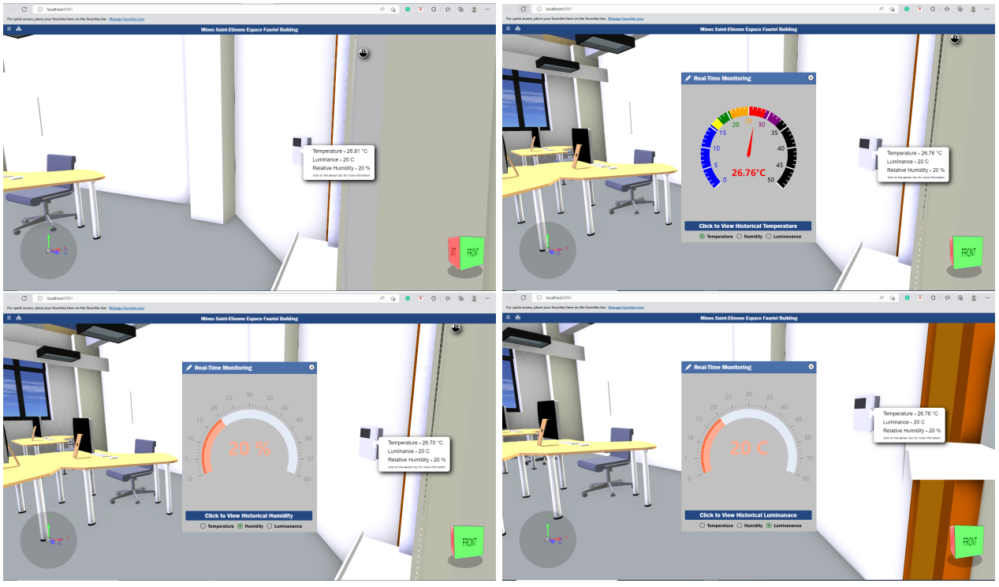
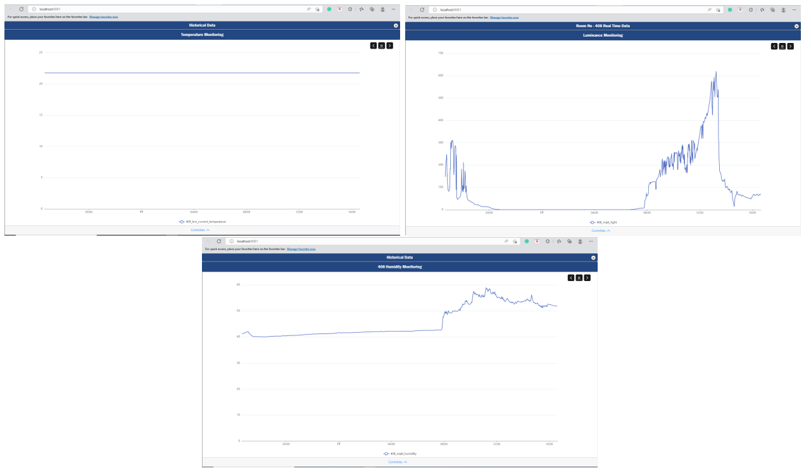
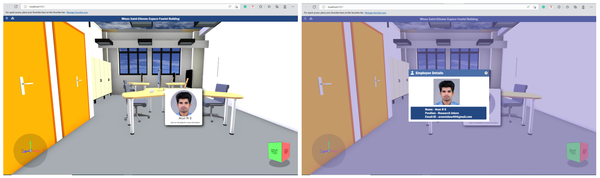

## Abstract 

Building Information Modeling (BIM) is adopted globally to describe and exchange building data
across disciplines during building design and construction. Furthermore, the Internet of Things (IoT) devices are widely used in the construction industry to monitor building environment data for various benefits. In this scenario, numerous studies are going to integrate the BIM model of a building and data collected from the IoT devices installed and thus develop the Digital Twin of the building. However, several challenges still need to be solved for efficient integration and data monitoring through BIM with web technologies. So the objective is to create a more reliable method to integrate BIM with other technologies and construct the digital twin of the intelligent building, thus visualizing in the web browser with performance.

In this work, we addressed some challenges for developing the digital twin of smart building and
proposed a research framework for integrating BIM and other technologies like IoT using semantic web technologies and visualizing the BIM in the browser. The proposed framework enables the construction of a digital twin of the building, which is a hot topic in the AECOO (Architecture, Engineering, Construction, Owner, and Operation) industry. The main idea behind the framework is composed of three different phases. The first phase, called BIM as Modular Knowledge Graphs, concentrates on developing a tool to create modular knowledge graphs from the BIM model by extracting the building data. The second phase, New Knowledge Augmentation, integrates more data sources and technologies into the generated modular knowledge graphs. Furthermore, in the third phase, Digital Twin Visualization, we visualized the external data sources integrated with BIM and the 3D model of the building in a browser.

We used the BIM model of the MINES Saint-Etienne Espace Fauriel building developed in Autodesk
Revit, and the intelligent building architecture exists in the same building to validate the different phases of the framework.

## Proposed Framework

1. BIM to Modular Knowledge Graphs - Convert BIM models into modular knowledge
graphs, and all are published via REST API.
2. New Knowledge Augmentation - Integrate new knowledge like IOT to the modular knowledge graphs generated from the BIM model using Linked data principles.
3. Visualisation of Digital Twin - Visualise BIM in the browser using the modular knowledge
graphs and thus produce the digital twin of the smart building.

### Phase 1 -  BIM to Modular Knowledge Graphs

###  Phase 2 - New Knowledge Augmentation 

### Phase 3 - Visualization of Digital Twin

#### Work flow to visualize the digital model of a building in browser

#### Component diagram of Phase 3

## Results

###  Digital model visualization of Espace Fauriel building in browser

###  Window Status monitoring of Espace Fauriel building uisng the digital model

### Real-time Comfort parameter monitoring of Espace Fauriel building  using the digital model

###  Historical comfort parameter monitoring of Espace Fauriel building

### Occupant status monitoring of Espace Fauriel building

